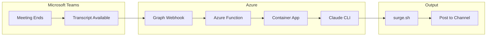
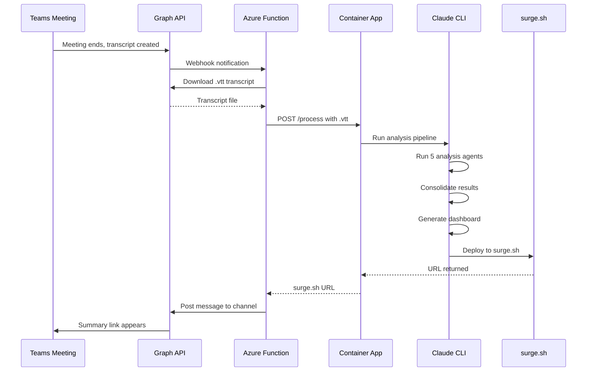

# Project T.I.G.E.R. Automation Pipeline

Automate meeting transcript processing from Microsoft Teams through to surge.sh deployment, with notifications back to the channel.

---

## ✅ Current Status

| Component | Status | Notes |
|-----------|--------|-------|
| App Registration | ✅ DONE | Permissions configured (OnlineMeetings.Read.All, OnlineMeetingTranscript.Read.All, ChannelMessage.Send, User.Read.All) |
| Resource Group | ✅ DONE | Dev Container Apps environment provisioned |
| API Key | ✅ DONE | ANTHROPIC_API_KEY available |
| Dockerfile | ❌ TODO | **NEXT: Build container with Claude CLI, Node.js, surge** |
| Container App | ⏳ PARTIAL | Resource group exists, needs deployment config |
| Azure Function | ❌ TODO | Webhook receiver not yet created |
| Graph Subscription | ❌ TODO | Webhooks not wired up |
| Channel Notification | ❌ TODO | Teams posting not configured |

---

## 🚀 What to Do Next (Immediate Action Items)

### 1. **Create `.env` file** (5 minutes)
```bash
cp .env.example .env
```

Edit `.env` and set:
```
ANTHROPIC_API_KEY=sk-ant-api03-YOUR-KEY-HERE
SURGE_LOGIN=your_email@example.com
SURGE_TOKEN=your_surge_token_here
CLAUDE_CODE_OAUTH_TOKEN=  # Leave empty if using API key
```

**Get Surge credentials:**
- Install surge - `npm instal --global surge`
- surge login
- surge token 

---

### 2. **Build the Dockerfile** (in progress)
Create `Dockerfile` at project root with:
- Node.js base image
- Claude CLI installation (via npm)
- surge-cli installation
- Your project files copied in
- Environment variables passed at runtime
- HTTP server listening for processing requests

**Location:** `/Users/joshberman/Desktop/ClaudeCode.MeetingSummariser-1/Dockerfile`

---

### 3. **Create Container App server** (in progress)
Create `server.py` or `server.js` that:
- Listens on port 8080 (Azure Container Apps default)
- Accepts `POST /process` with .vtt transcript file
- Runs Claude CLI to process transcript
- Returns surge.sh URL when done

**Location:** `/container-app/server.js` (or .py)

---

### 4. **Deploy Container App to Azure** (in progress)
Once Dockerfile & server are ready:
```bash
# Build and push to Azure Container Registry
az acr build --registry your-acr --image tiger-processor:latest .

# Create Container App (or update existing)
az containerapp create \
  --resource-group your-resource-group \
  --name tiger-processor \
  --image your-acr.azurecr.io/tiger-processor:latest \
  --environment tiger-env \
  --ingress external \
  --target-port 8080 \
  --secrets "anthropic-api-key=$ANTHROPIC_API_KEY" "surge-token=$SURGE_TOKEN" \
  --env-vars "ANTHROPIC_API_KEY=secretref:anthropic-api-key" "SURGE_TOKEN=secretref:surge-token"
```

**Note:** This gives you a public HTTPS endpoint that the Azure Function will call.

---

## Overview

Transform your manual 20-minute process into a fully automated pipeline that triggers when a Teams meeting ends.



---

## Step 1: Azure App Registration (Identity)

**What it is:** An App Registration is like creating an "identity card" for your automation. It tells Microsoft "this application is allowed to access Teams data on behalf of your organization."

**Why we need it:** Microsoft Graph API (which gives us access to Teams transcripts) requires authentication. Without this, we can't programmatically access meeting data.

**Graph Permissions Required:**

| Permission | Type | Purpose |

|------------|------|---------|

| `OnlineMeetings.Read.All` | Application | Read meeting details |

| `OnlineMeetingTranscript.Read.All` | Application | Download .vtt transcripts |

| `ChannelMessage.Send` | Application | Post summary URL back to channel |

| `User.Read.All` | Application | Resolve user names from IDs |

**Admin Consent:** Required because these are Application permissions (not delegated), meaning they work without a user being signed in.

---

## Step 2: Azure Function (Webhook Receiver)

**What it is:** A small piece of code that runs in the cloud, triggered by HTTP requests. Think of it as a "listener" waiting for Microsoft to tell it something happened.

**Why we need it:** Microsoft Graph uses webhooks to notify us when something changes (like a new transcript appearing). The Function receives this notification and kicks off the processing.

**What it does:**

1. Receives webhook notification: "Hey, meeting X just got a transcript"
2. Validates the notification is genuine (using a secret)
3. Downloads the .vtt transcript file from Graph API
4. Sends the transcript to your Container App for processing
5. Receives the surge.sh URL back
6. Posts the URL to the Teams channel

**Tech:** Azure Functions (Python or Node.js), HTTP trigger

---

## Step 3: Graph API Subscription (Webhook Setup)

**What it is:** A "subscription" tells Microsoft Graph: "Whenever a new transcript is created, send a notification to my Azure Function."

**Why we need it:** Without this, we'd have to constantly poll (ask repeatedly) "any new transcripts?" which is inefficient and slow. Webhooks are instant notifications.

**The catch:** Subscriptions expire (max 4230 minutes / ~3 days for most resources). We'll need a timer-triggered Function to renew them automatically.

---

## Step 4: Docker Container with Claude CLI

**What it is:** A Docker container is like a "portable computer" - it packages your code, Claude CLI, and all dependencies into one unit that runs the same everywhere.

**Why we need it:**

- Claude CLI needs a persistent environment with your API key configured
- It needs Node.js for surge.sh deployment
- Docker ensures consistent behavior between dev and prod

**What goes in the container:**

- Claude CLI (installed and authenticated)
- Your project files ([`CLAUDE.md`](CLAUDE.md), agents, templates, skills)
- Node.js + surge CLI
- A simple HTTP server to receive processing requests

---

## Step 5: Azure Container Apps (Hosting)

**What it is:** Azure Container Apps runs your Docker containers without you managing servers. It can scale to zero when not in use (saving money) and scale up when processing.

**Why we need it (vs alternatives):**

- **vs Azure Container Instances:** Container Apps has built-in HTTP ingress, scaling, and is more production-ready
- **vs Azure VM:** No server management, pay only when running
- **vs Local server:** No need to keep a machine running 24/7

**Configuration:**

- Min replicas: 0 (scales to zero when idle)
- Max replicas: 1 (one meeting at a time is fine)
- CPU: 2 cores, Memory: 4GB (Claude CLI needs some resources)

---

## Step 6: Surge.sh Deployment (Already Working)

**What it is:** Your existing deployment target - a free static hosting service.

**Why it works:** Claude CLI already knows how to deploy here via the skills in your project. The container just needs surge CLI installed and authenticated.

---

## Step 7: Teams Channel Notification

**What it is:** After the dashboard is deployed, post the URL back to the originating Teams channel.

**Why we need it:** Closes the loop - team members see the summary without having to check a separate location.

**How:** Use Graph API `POST /teams/{team-id}/channels/{channel-id}/messages` with an Adaptive Card containing the surge.sh URL.

---

## Architecture Diagram



---

## Detailed Next Steps

### Phase 1: Container Setup (Days 1-2)

#### Step 1.1: Create Dockerfile

**Goal:** Package Claude CLI in a container that can run independently

**What it needs:**
```dockerfile
FROM node:18-slim

# Install Python (for server)
RUN apt-get update && apt-get install -y python3 pip

# Install Claude CLI globally
RUN npm install -g @anthropic-ai/claude-code

# Install surge CLI
RUN npm install -g surge

# Copy your project
COPY . /app
WORKDIR /app

# Install Node dependencies for server
RUN npm install

# Expose port for Container App
EXPOSE 8080

# Start server
CMD ["node", "server.js"]
```

**Key considerations:**
- Claude CLI needs to be installed in a way that survives container build
- API key will be passed as environment variable at runtime (not baked in)
- Server runs on 8080 (Azure Container Apps standard)
- Project files (CLAUDE.md, agents, templates) must be copied in

---

#### Step 1.2: Create Container Server (server.js)

**Goal:** HTTP endpoint that receives transcripts and runs Claude CLI

```javascript
const express = require('express');
const fs = require('fs');
const path = require('path');
const { exec } = require('child_process');
const app = express();

app.use(express.raw({ type: 'text/plain', limit: '50mb' }));

app.post('/process', async (req, res) => {
  try {
    // 1. Save transcript to temp file
    const transcriptPath = path.join('/tmp', `transcript-${Date.now()}.vtt`);
    fs.writeFileSync(transcriptPath, req.body);

    // 2. Extract project name from request header or body
    const projectName = req.headers['x-project-name'] || 'default';

    // 3. Run Claude CLI with transcript
    // Claude CLI will:
    //   - Run parallel analysis agents
    //   - Generate consolidated.json
    //   - Create dashboard HTML
    //   - Deploy to surge.sh
    const command = `claude /path/to/process-transcript.mcp ${transcriptPath} ${projectName}`;

    // 4. Capture surge.sh URL from output
    const output = await execAsync(command);
    const dashboardUrl = extractSurgeUrl(output);

    // 5. Return URL to Azure Function
    res.json({
      success: true,
      dashboardUrl: dashboardUrl,
      projectName: projectName
    });

  } catch (error) {
    res.status(500).json({ success: false, error: error.message });
  }
});

app.listen(8080, () => console.log('Server running on port 8080'));
```

**Key considerations:**
- Receives .vtt file in request body
- Extracts project name from header
- Runs Claude CLI (which handles all the magic)
- Returns surge.sh URL to caller
- Error handling for failed processing

---

#### Step 1.3: Test Locally with Docker Compose

Before pushing to Azure, test locally:

```bash
# Build locally
docker-compose build

# Run with local .env
docker-compose run --rm meeting-processor

# Test with manual curl
curl -X POST \
  -H "x-project-name: test-project" \
  --data-binary @/path/to/transcript.vtt \
  http://localhost:8080/process
```

**What to verify:**
- Container starts without errors
- Claude CLI initializes with API key
- Server accepts /process requests
- Returns a valid surge.sh URL

---

### Phase 2: Deploy to Azure (Days 2-3)

#### Step 2.1: Set up Azure Container Registry (ACR)

```bash
# Create container registry
az acr create --resource-group your-rg --name tigerprocessor --sku Basic

# Login
az acr login --name tigerprocessor
```

---

#### Step 2.2: Build and Push Image

```bash
# Build from Dockerfile and push to ACR
az acr build \
  --registry tigerprocessor \
  --image tiger-processor:latest \
  --file Dockerfile .

# Note the image URI: tigerprocessor.azurecr.io/tiger-processor:latest
```

---

#### Step 2.3: Deploy Container App

```bash
# First create a Container Apps environment if you don't have one
az containerapp env create \
  --name tiger-env \
  --resource-group your-rg \
  --location eastus

# Deploy the container
az containerapp create \
  --name tiger-processor \
  --resource-group your-rg \
  --environment tiger-env \
  --image tigerprocessor.azurecr.io/tiger-processor:latest \
  --target-port 8080 \
  --ingress external \
  --cpu 2 \
  --memory 4Gi \
  --min-replicas 0 \
  --max-replicas 1 \
  --secrets \
    "anthropic-api-key=$ANTHROPIC_API_KEY" \
    "surge-login=$SURGE_LOGIN" \
    "surge-token=$SURGE_TOKEN" \
  --env-vars \
    "ANTHROPIC_API_KEY=secretref:anthropic-api-key" \
    "SURGE_LOGIN=secretref:surge-login" \
    "SURGE_TOKEN=secretref:surge-token"
```

**Result:** You get a public HTTPS URL like `https://tiger-processor.XXX.azurecontainers.io`

---

#### Step 2.4: Test Container App

```bash
# Get the container app URL
CONTAINER_URL=$(az containerapp show --name tiger-processor --resource-group your-rg --query properties.ingress.fqdn -o tsv)

# Test the endpoint
curl -X POST \
  -H "x-project-name: test-project" \
  --data-binary @/path/to/transcript.vtt \
  https://$CONTAINER_URL/process

# Should return: { "success": true, "dashboardUrl": "https://..." }
```

---

### Phase 3: Azure Function (Days 3-4)

Once Container App is deployed and tested, build the Azure Function that:

1. **Receives webhook from Graph API** when transcript is created
2. **Downloads the .vtt file** from Graph API
3. **POSTs to Container App** /process endpoint
4. **Receives dashboard URL** back
5. **Posts to Teams channel** with the link

**Will detail this in next section once Phases 1-2 are complete**

---

## Files to Create

| File | Purpose |

|------|---------|

| `Dockerfile` | Container definition with Claude CLI, Node.js, surge |

| `azure-function/` | Webhook receiver, transcript downloader, channel notifier |

| `container-app/server.py` | HTTP endpoint to receive processing requests |

| `scripts/deploy.sh` | Deployment automation |

| `bicep/main.bicep` | Infrastructure as Code (optional but recommended) |

---

## Development Order

The recommended order to build and test each component:

### ✅ COMPLETED
- [x] App Registration (identity)
- [x] API Key obtained

### 🔄 IN PROGRESS (Next)
- [ ] **Dockerfile** - Get Claude CLI running in a container locally first
  - Create Dockerfile with Node.js, Claude CLI, surge CLI
  - Create server.js/server.py HTTP endpoint
  - Test locally: `docker-compose up`

- [ ] **Container App** - Deploy to Azure Container Apps
  - Build and push image to ACR
  - Deploy Container App with secrets management
  - Test with curl to public HTTPS endpoint
  - **Goal:** `/process` endpoint accepts .vtt and returns surge.sh URL

### ⏳ PHASE 2 (After Phase 1 works)
- [ ] **Azure Function** - Build webhook receiver
  - HTTP trigger to receive Graph API notifications
  - Download transcript from Graph API
  - POST to Container App /process endpoint
  - Store original meeting/channel metadata

- [ ] **Graph Subscription** - Automate the trigger
  - Create subscription for `chatMessage` changes in Teams channels
  - Point subscription to Azure Function
  - Set up timer-triggered renewal function (subscriptions expire every 3 days)

- [ ] **Channel Notification** - Complete the loop
  - Receive surge.sh URL from Container App
  - POST message back to Teams channel with Adaptive Card
  - Include link to dashboard

---

## App Registration Details (For Reference)

Your App Registration needs these credentials for later steps:

| Credential | Where to Find | Used For |
|-----------|---------------|----------|
| **Client ID** | Azure Portal → App Registration → Overview | Graph API authentication |
| **Client Secret** | Azure Portal → App Registration → Certificates & Secrets | Graph API authentication |
| **Tenant ID** | Azure Portal → App Registration → Overview | Graph API endpoints |

**You'll need these for:**
- Azure Function to authenticate with Graph API
- Downloading transcripts
- Posting messages back to Teams

**Get them now:**
```bash
# From Azure CLI
az ad app show --id <your-app-id> --query appId -o tsv
```

---

## Required Credentials Checklist

Before proceeding, ensure you have:

```
✅ ANTHROPIC_API_KEY = sk-ant-api03-...
✅ SURGE_LOGIN = your@email.com
✅ SURGE_TOKEN = from surge.sh account
☐ AZURE_SUBSCRIPTION_ID = (for Azure CLI commands)
☐ AZURE_RESOURCE_GROUP = (your dev resource group name)
☐ AZURE_CONTAINER_REGISTRY_NAME = (will create in Phase 2)
☐ APP_CLIENT_ID = (from app registration)
☐ APP_CLIENT_SECRET = (from app registration)
☐ APP_TENANT_ID = (from app registration)
```

---

## Estimated Costs (Dev)

| Resource | Cost |

|----------|------|

| Azure Function | Free tier (1M executions/month) |

| Container Apps | ~$0.10/hour when running, $0 at idle |

| Graph API | Free |

| surge.sh | Free |

**Monthly estimate:** Under $5 for typical Sprint meeting frequency.