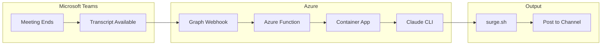
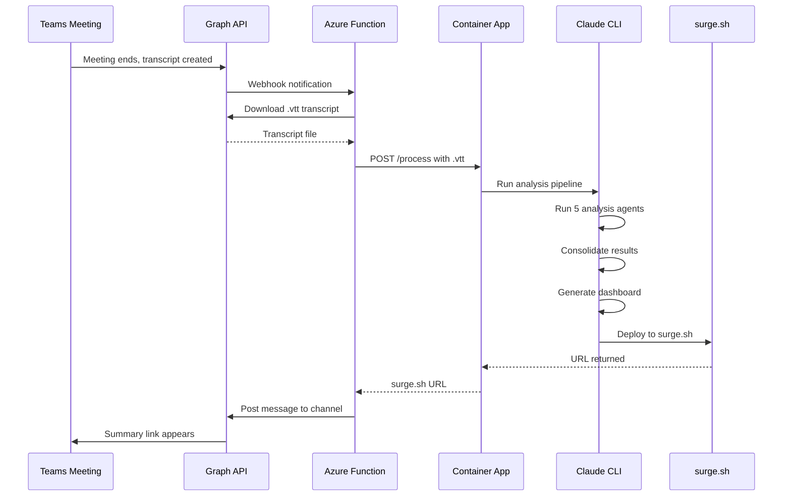
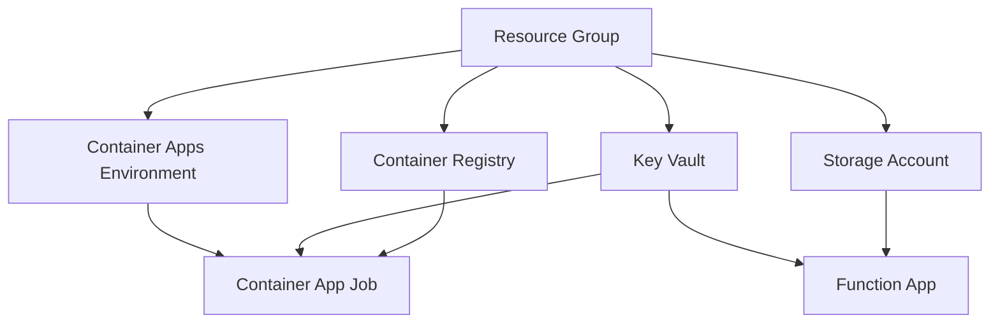

# Project T.I.G.E.R. Automation Pipeline

Automate meeting transcript processing from Microsoft Teams through to surge.sh deployment, with notifications back to the channel.

---

## ✅ Current Status

| Component | Status | Notes |
|-----------|--------|-------|
| App Registration | ✅ DONE | Permissions configured (OnlineMeetings.Read.All, OnlineMeetingTranscript.Read.All, ChannelMessage.Send, User.Read.All) |
| Resource Group | ✅ DONE | Dev Container Apps environment provisioned |
| API Key | ✅ DONE | ANTHROPIC_API_KEY available |
| Dockerfile | ✅ DONE | Claude CLI, Node.js, surge all configured |
| processor.js | ✅ DONE | Wrapper for Claude CLI, handles credentials and output |
| docker-compose.yml | ✅ DONE | Local testing configuration ready |
| Local Testing | ⏳ NEXT | **Test container locally before pushing to Azure** |
| Azure Container Registry | ❌ TODO | Push image after local validation |
| Container App Deployment | ❌ TODO | Deploy to Azure with proper secrets |
| **Bicep IaC** | ❌ TODO | Infrastructure as Code for repeatable deployments |
| Azure Function | ❌ TODO | Webhook receiver for Graph API |
| Graph Subscription | ❌ TODO | Webhooks to trigger function |
| Channel Notification | ❌ TODO | Post results back to Teams |

---

## 🚀 What to Do Next (Immediate Action Items)

### 1. **Create `.env` file** (5 minutes)

You already have `.env.example`. Copy it and fill in your credentials:

```bash
cp .env.example .env
```

Edit `.env` and set:
```
ANTHROPIC_API_KEY=sk-ant-api03-YOUR-KEY-HERE
SURGE_EMAIL=your_email@example.com
SURGE_TOKEN=your_surge_token_here
CLAUDE_CODE_OAUTH_TOKEN=  # Leave empty if using API key
```

**Get Surge credentials:**
```bash
# Install surge globally (one time)
npm install --global surge

# Login and get token
surge login
surge token
```

Your credentials are stored in `~/.netrc` after login.

---

### 2. **Test Locally with Docker Compose** (30-45 minutes)

Before pushing to Azure, validate that everything works on your machine:

```bash
# Make sure you have .env file with credentials
cat .env  # Verify ANTHROPIC_API_KEY and SURGE_* are set

# Build the container locally
docker-compose build

# Get a test transcript file
# Create a dummy transcript or use an existing one
# Must be named with YYYY-MM-DD format: 2026-01-23-test.vtt

# Run the processor
docker-compose run --rm meeting-processor /app/dropzone/2026-01-23-test.vtt test-project

# Expected output:
# - Logs showing Claude CLI initialization
# - Analysis agents running (timeline, people, insights, etc.)
# - Dashboard generated
# - surge.sh URL returned
```

**What to verify:**
- Container builds without errors
- Claude CLI initializes with your API key
- processor.js runs successfully
- Dashboard is generated in `projects/test-project/2026-01-23-test/dashboard/index.html`
- Dashboard is deployed to surge.sh (check final logs for URL)

**Troubleshooting:**
- If Claude auth fails: Check ANTHROPIC_API_KEY is correct in `.env`
- If surge deployment fails: Check SURGE_EMAIL and SURGE_TOKEN
- If container won't build: Check that Docker Desktop is running

---

### 3. **Set Up Azure Container Registry (ACR)**

Once local testing passes, push to Azure:

```bash
# Get your subscription and resource group details
SUBSCRIPTION_ID=$(az account show --query id -o tsv)
RESOURCE_GROUP="your-rg-name"  # Update with your resource group
REGISTRY_NAME="tigerprocessor"  # Choose a unique name

# Create Container Registry
az acr create \
  --resource-group $RESOURCE_GROUP \
  --name $REGISTRY_NAME \
  --sku Basic \
  --location eastus

# Login to ACR
az acr login --name $REGISTRY_NAME
```

---

### 4. **Build and Push Image to ACR**

```bash
# Build container and push directly to ACR
az acr build \
  --registry $REGISTRY_NAME \
  --image tiger-processor:latest \
  --file Dockerfile .

# This will output the image URI:
# $REGISTRY_NAME.azurecr.io/tiger-processor:latest
```

---

### 5. **Deploy to Azure Container Apps**

```bash
# Store credentials as secrets in Container Apps
az containerapp create \
  --name tiger-processor \
  --resource-group $RESOURCE_GROUP \
  --image $REGISTRY_NAME.azurecr.io/tiger-processor:latest \
  --registry-server $REGISTRY_NAME.azurecr.io \
  --target-port 8080 \
  --ingress external \
  --cpu 2.0 \
  --memory 4Gi \
  --min-replicas 0 \
  --max-replicas 1 \
  --secrets \
    "anthropic-api-key=$ANTHROPIC_API_KEY" \
    "surge-email=$SURGE_EMAIL" \
    "surge-token=$SURGE_TOKEN" \
  --env-vars \
    "ANTHROPIC_API_KEY=secretref:anthropic-api-key" \
    "SURGE_EMAIL=secretref:surge-email" \
    "SURGE_TOKEN=secretref:surge-token" \
    "NODE_ENV=production" \
    "OUTPUT_DIR=/app/output"

# Get the public HTTPS endpoint
CONTAINER_URL=$(az containerapp show \
  --name tiger-processor \
  --resource-group $RESOURCE_GROUP \
  --query properties.ingress.fqdn \
  -o tsv)

echo "Container App URL: https://$CONTAINER_URL"
```

**Result:** You now have a public HTTPS endpoint that can receive transcripts via HTTP POST.

---

### 6. **Test Container App Endpoint** (Optional but recommended)

```bash
# Get your container app URL
CONTAINER_URL=$(az containerapp show \
  --name tiger-processor \
  --resource-group $RESOURCE_GROUP \
  --query properties.ingress.fqdn \
  -o tsv)

# Test with a transcript file
curl -X POST \
  -H "x-project-name: test-project" \
  --data-binary @/path/to/transcript.vtt \
  https://$CONTAINER_URL/process

# Expected response:
# { "success": true, "dashboardUrl": "https://test-project-2026-01-23.surge.sh" }
```

**Note:** The container app needs an HTTP server listening on port 8080. Currently, `processor.js` is CLI-only. You'll need to add a server wrapper for Azure Function to call it. This comes next.

---

## Overview

Transform your manual 20-minute process into a fully automated pipeline that triggers when a Teams meeting ends.



---

## Step 1: Azure App Registration (Identity)

**What it is:** An App Registration is like creating an "identity card" for your automation. It tells Microsoft "this application is allowed to access Teams data on behalf of your organization."

**Why we need it:** Microsoft Graph API (which gives us access to Teams transcripts) requires authentication. Without this, we can't programmatically access meeting data.

**Graph Permissions Required:**

| Permission | Type | Purpose |

|------------|------|---------|

| `OnlineMeetings.Read.All` | Application | Read meeting details |

| `OnlineMeetingTranscript.Read.All` | Application | Download .vtt transcripts |

| `ChannelMessage.Send` | Application | Post summary URL back to channel |

| `User.Read.All` | Application | Resolve user names from IDs |

**Admin Consent:** Required because these are Application permissions (not delegated), meaning they work without a user being signed in.

---

## Step 2: Azure Function (Webhook Receiver)

**What it is:** A small piece of code that runs in the cloud, triggered by HTTP requests. Think of it as a "listener" waiting for Microsoft to tell it something happened.

**Why we need it:** Microsoft Graph uses webhooks to notify us when something changes (like a new transcript appearing). The Function receives this notification and kicks off the processing.

**What it does:**

1. Receives webhook notification: "Hey, meeting X just got a transcript"
2. Validates the notification is genuine (using a secret)
3. Downloads the .vtt transcript file from Graph API
4. Sends the transcript to your Container App for processing
5. Receives the surge.sh URL back
6. Posts the URL to the Teams channel

**Tech:** Azure Functions (Python or Node.js), HTTP trigger

---

## Step 3: Graph API Subscription (Webhook Setup)

**What it is:** A "subscription" tells Microsoft Graph: "Whenever a new transcript is created, send a notification to my Azure Function."

**Why we need it:** Without this, we'd have to constantly poll (ask repeatedly) "any new transcripts?" which is inefficient and slow. Webhooks are instant notifications.

**The catch:** Subscriptions expire (max 4230 minutes / ~3 days for most resources). We'll need a timer-triggered Function to renew them automatically.

---

## Step 4: Docker Container with Claude CLI

**What it is:** A Docker container is like a "portable computer" - it packages your code, Claude CLI, and all dependencies into one unit that runs the same everywhere.

**Why we need it:**

- Claude CLI needs a persistent environment with your API key configured
- It needs Node.js for surge.sh deployment
- Docker ensures consistent behavior between dev and prod

**What goes in the container:**

- Claude CLI (installed and authenticated)
- Your project files ([`CLAUDE.md`](CLAUDE.md), agents, templates, skills)
- Node.js + surge CLI
- A simple HTTP server to receive processing requests

---

## Step 5: Azure Container Apps (Hosting)

**What it is:** Azure Container Apps runs your Docker containers without you managing servers. It can scale to zero when not in use (saving money) and scale up when processing.

**Why we need it (vs alternatives):**

- **vs Azure Container Instances:** Container Apps has built-in HTTP ingress, scaling, and is more production-ready
- **vs Azure VM:** No server management, pay only when running
- **vs Local server:** No need to keep a machine running 24/7

**Configuration:**

- Min replicas: 0 (scales to zero when idle)
- Max replicas: 1 (one meeting at a time is fine)
- CPU: 2 cores, Memory: 4GB (Claude CLI needs some resources)

---

## Step 6: Surge.sh Deployment (Already Working)

**What it is:** Your existing deployment target - a free static hosting service.

**Why it works:** Claude CLI already knows how to deploy here via the skills in your project. The container just needs surge CLI installed and authenticated.

---

## Step 7: Teams Channel Notification

**What it is:** After the dashboard is deployed, post the URL back to the originating Teams channel.

**Why we need it:** Closes the loop - team members see the summary without having to check a separate location.

**How:** Use Graph API `POST /teams/{team-id}/channels/{channel-id}/messages` with an Adaptive Card containing the surge.sh URL.

---

## Architecture Diagram



---

## Current State Summary

You already have the **Container** piece built and ready:

| Component | Status |
|-----------|--------|
| Dockerfile | ✅ Complete - Claude CLI, surge, proper user setup |
| processor.js | ✅ Complete - Handles credential validation, directory setup, Claude invocation |
| docker-compose.yml | ✅ Complete - Volume mounts and environment variables configured |
| entrypoint.sh | ✅ Complete - Container startup script |

**The container works as a command-line processor:** Takes a transcript path and project name, runs the full analysis pipeline, and deploys to surge.sh.

---

## Detailed Next Steps

### Phase 1: Validate Locally (Day 1)

#### Why This Matters
Testing locally before pushing to Azure saves hours. You'll catch credential issues and validation problems on your machine instead of debugging in the cloud.

#### Steps

1. **Prepare test transcript** (Get one from a real Teams meeting or create a dummy .vtt)

2. **Run local test:**
   ```bash
   # Set up credentials in .env
   cp .env.example .env
   # Edit .env with ANTHROPIC_API_KEY, SURGE_EMAIL, SURGE_TOKEN

   # Build container
   docker-compose build

   # Put test transcript in dropzone/
   mkdir -p dropzone
   cp your-transcript.vtt dropzone/2026-01-23-test.vtt

   # Run processor
   docker-compose run --rm meeting-processor /app/dropzone/2026-01-23-test.vtt test-project
   ```

3. **Check output:**
   ```bash
   # Dashboard should be here
   ls -la projects/test-project/2026-01-23-test/dashboard/index.html

   # Check logs for surge.sh URL in the output
   # Should see: DEPLOYED_URL=https://test-project-2026-01-23.surge.sh
   ```

**Success criteria:**
- ✅ Container builds and runs
- ✅ Claude CLI authenticates with your API key
- ✅ Analysis completes (takes 5-10 minutes)
- ✅ Dashboard appears in projects folder
- ✅ surge.sh deployment succeeds (you can visit the URL)

---

### Phase 2: Push to Azure (Day 2)

Once local testing passes, you're ready for Azure.

#### Step 2.1: Create Azure Container Registry

```bash
# Set variables for your Azure environment
RESOURCE_GROUP="your-rg-name"  # The dev resource group you created
REGISTRY_NAME="tigerprocessor"  # Must be globally unique
LOCATION="eastus"

# Create registry
az acr create \
  --resource-group $RESOURCE_GROUP \
  --name $REGISTRY_NAME \
  --sku Basic \
  --location $LOCATION

# Authenticate
az acr login --name $REGISTRY_NAME
```

#### Step 2.2: Build and Push to ACR

```bash
# Build container from your Dockerfile and push to ACR
az acr build \
  --registry $REGISTRY_NAME \
  --image tiger-processor:latest \
  --file Dockerfile .

# Output will show: Sending context (XX MB)...
# Wait for build to complete (2-5 minutes)
```

#### Step 2.3: Deploy to Container Apps

```bash
# Create the Container App with your image
az containerapp create \
  --name tiger-processor \
  --resource-group $RESOURCE_GROUP \
  --image ${REGISTRY_NAME}.azurecr.io/tiger-processor:latest \
  --registry-server ${REGISTRY_NAME}.azurecr.io \
  --target-port 8080 \
  --ingress external \
  --cpu 2.0 \
  --memory 4Gi \
  --min-replicas 0 \
  --max-replicas 1 \
  --secrets \
    "anthropic-api-key=${ANTHROPIC_API_KEY}" \
    "surge-email=${SURGE_EMAIL}" \
    "surge-token=${SURGE_TOKEN}" \
  --env-vars \
    "ANTHROPIC_API_KEY=secretref:anthropic-api-key" \
    "SURGE_EMAIL=secretref:surge-email" \
    "SURGE_TOKEN=secretref:surge-token" \
    "NODE_ENV=production" \
    "OUTPUT_DIR=/app/output"

# Get your Container App HTTPS URL
CONTAINER_URL=$(az containerapp show \
  --name tiger-processor \
  --resource-group $RESOURCE_GROUP \
  --query properties.ingress.fqdn \
  -o tsv)

echo "✅ Container App deployed at: https://$CONTAINER_URL"
```

**What's happening:**
- Container App pulls your image from ACR
- Sets environment variables (secrets are injected securely)
- Scales to zero when idle (saves money)
- Becomes available at a public HTTPS URL

---

### Phase 3: Azure Function + Graph Webhooks (Day 3-4)

After Container App is working, build the automation:

1. **Azure Function** (Node.js, HTTP trigger)
   - Receives webhook notification from Microsoft Graph
   - Downloads .vtt transcript from Graph API
   - POSTs transcript to Container App /process endpoint
   - Receives surge.sh URL back

2. **Graph Subscription**
   - Tells Microsoft: "When a transcript is created, notify my Azure Function"
   - Subscription expires every 3 days (need renewal function)

3. **Teams Channel Notification**
   - Function posts the surge.sh URL back to Teams

**This will be detailed separately once Container App is deployed and tested.**

---

## Files to Create

| File | Purpose |
|------|---------|
| `Dockerfile` | Container definition with Claude CLI, Node.js, surge |
| `azure-function/` | Webhook receiver, transcript downloader, channel notifier |
| `container-app/server.py` | HTTP endpoint to receive processing requests |
| `scripts/deploy.sh` | Deployment automation |
| `infra/main.bicep` | Main orchestration module |
| `infra/modules/acr.bicep` | Azure Container Registry |
| `infra/modules/containerApp.bicep` | Container App + Environment |
| `infra/modules/keyVault.bicep` | Key Vault for secrets |
| `infra/modules/functionApp.bicep` | Azure Function App |
| `infra/modules/storage.bicep` | Storage account for Function App |
| `infra/main.bicepparam` | Parameter file for deployments |

---

## 🏗️ Bicep Infrastructure as Code (IaC)

### Why Bicep?

- **Repeatable**: Deploy identical infrastructure every time
- **Version controlled**: Track infrastructure changes in git
- **Environment parity**: Dev, staging, prod use same templates
- **Self-documenting**: Infrastructure is code you can read
- **Azure-native**: First-class support, no state file to manage

### Bicep File Structure

```
infra/
├── main.bicep                    # Main orchestration - deploys all modules
├── main.bicepparam               # Parameter values (dev/prod)
└── modules/
    ├── acr.bicep                 # Azure Container Registry
    ├── containerApp.bicep        # Container App + Environment
    ├── containerAppJob.bicep     # Container App Job (for processing)
    ├── keyVault.bicep            # Key Vault + secrets references
    ├── functionApp.bicep         # Azure Function App
    └── storage.bicep             # Storage Account
```

### Resource Dependencies



### Deployment Commands

#### Option A: One-Command Deploy (Recommended)

```bash
# Deploy all infrastructure
az deployment sub create \
  --location australiaeast \
  --template-file infra/main.bicep \
  --parameters infra/main.bicepparam \
  --parameters environment=dev

# Or for production
az deployment sub create \
  --location australiaeast \
  --template-file infra/main.bicep \
  --parameters infra/main.bicepparam \
  --parameters environment=prod
```

#### Option B: What-If Preview (Before Deploying)

```bash
# Preview what will be created/changed
az deployment sub what-if \
  --location australiaeast \
  --template-file infra/main.bicep \
  --parameters infra/main.bicepparam \
  --parameters environment=dev
```

#### Option C: Deploy with GitHub Actions

```yaml
# .github/workflows/deploy-infra.yml
name: Deploy Infrastructure

on:
  push:
    branches: [main]
    paths: ['infra/**']
  workflow_dispatch:
    inputs:
      environment:
        description: 'Environment to deploy'
        required: true
        default: 'dev'
        type: choice
        options: [dev, prod]

jobs:
  deploy:
    runs-on: ubuntu-latest
    steps:
      - uses: actions/checkout@v4

      - uses: azure/login@v2
        with:
          creds: ${{ secrets.AZURE_CREDENTIALS }}

      - name: Deploy Bicep
        uses: azure/arm-deploy@v2
        with:
          scope: subscription
          region: australiaeast
          template: infra/main.bicep
          parameters: >
            infra/main.bicepparam
            environment=${{ inputs.environment || 'dev' }}
```

### Key Bicep Modules

#### `main.bicep` - Orchestration

```bicep
targetScope = 'subscription'

@description('Environment name')
@allowed(['dev', 'prod'])
param environment string = 'dev'

@description('Location for all resources')
param location string = 'australiaeast'

@description('Project name used for resource naming')
param projectName string = 'tiger'

// Resource Group
resource rg 'Microsoft.Resources/resourceGroups@2024-03-01' = {
  name: 'rg-${projectName}-${environment}'
  location: location
}

// Deploy modules
module keyVault 'modules/keyVault.bicep' = {
  name: 'keyVault'
  scope: rg
  params: {
    name: 'kv-${projectName}-${environment}'
    location: location
  }
}

module acr 'modules/acr.bicep' = {
  name: 'acr'
  scope: rg
  params: {
    name: '${projectName}${environment}acr'
    location: location
  }
}

module containerAppEnv 'modules/containerApp.bicep' = {
  name: 'containerAppEnv'
  scope: rg
  params: {
    name: 'cae-${projectName}-${environment}'
    location: location
    keyVaultName: keyVault.outputs.name
    acrName: acr.outputs.name
  }
}

output acrLoginServer string = acr.outputs.loginServer
output containerAppEnvId string = containerAppEnv.outputs.environmentId
output keyVaultUri string = keyVault.outputs.uri
```

#### `modules/containerApp.bicep` - Container App Job

```bicep
@description('Container Apps Environment name')
param name string

@description('Location')
param location string

@description('Key Vault name for secret references')
param keyVaultName string

@description('ACR name for image pull')
param acrName string

// Container Apps Environment
resource environment 'Microsoft.App/managedEnvironments@2024-03-01' = {
  name: name
  location: location
  properties: {
    zoneRedundant: false
  }
}

// Container App Job (for transcript processing)
resource processorJob 'Microsoft.App/jobs@2024-03-01' = {
  name: 'job-${name}-processor'
  location: location
  identity: {
    type: 'SystemAssigned'
  }
  properties: {
    environmentId: environment.id
    configuration: {
      triggerType: 'Manual'
      replicaTimeout: 1800  // 30 minutes max
      replicaRetryLimit: 1
      secrets: [
        {
          name: 'anthropic-api-key'
          keyVaultUrl: 'https://${keyVaultName}.vault.azure.net/secrets/anthropic-api-key'
          identity: 'system'
        }
        {
          name: 'surge-email'
          keyVaultUrl: 'https://${keyVaultName}.vault.azure.net/secrets/surge-email'
          identity: 'system'
        }
        {
          name: 'surge-token'
          keyVaultUrl: 'https://${keyVaultName}.vault.azure.net/secrets/surge-token'
          identity: 'system'
        }
      ]
      registries: [
        {
          server: '${acrName}.azurecr.io'
          identity: 'system'
        }
      ]
    }
    template: {
      containers: [
        {
          name: 'tiger-processor'
          image: '${acrName}.azurecr.io/tiger-processor:latest'
          resources: {
            cpu: json('2.0')
            memory: '4Gi'
          }
          env: [
            { name: 'ANTHROPIC_API_KEY', secretRef: 'anthropic-api-key' }
            { name: 'SURGE_EMAIL', secretRef: 'surge-email' }
            { name: 'SURGE_TOKEN', secretRef: 'surge-token' }
            { name: 'NODE_ENV', value: 'production' }
          ]
        }
      ]
    }
  }
}

output environmentId string = environment.id
output jobName string = processorJob.name
```

#### `modules/keyVault.bicep` - Secrets Management

```bicep
@description('Key Vault name')
param name string

@description('Location')
param location string

resource keyVault 'Microsoft.KeyVault/vaults@2024-04-01-preview' = {
  name: name
  location: location
  properties: {
    sku: {
      family: 'A'
      name: 'standard'
    }
    tenantId: subscription().tenantId
    enableRbacAuthorization: true  // Use RBAC instead of access policies
    enableSoftDelete: true
    softDeleteRetentionInDays: 7
  }
}

output name string = keyVault.name
output uri string = keyVault.properties.vaultUri
output id string = keyVault.id
```

### Post-Deployment Steps

After Bicep deployment, you still need to:

1. **Push container image to ACR**
   ```bash
   ACR_NAME=$(az deployment sub show --name main --query properties.outputs.acrLoginServer.value -o tsv)
   az acr build --registry $ACR_NAME --image tiger-processor:latest .
   ```

2. **Populate Key Vault secrets** (one-time manual step)
   ```bash
   KV_NAME="kv-tiger-dev"
   az keyvault secret set --vault-name $KV_NAME --name anthropic-api-key --value "sk-ant-..."
   az keyvault secret set --vault-name $KV_NAME --name surge-email --value "your@email.com"
   az keyvault secret set --vault-name $KV_NAME --name surge-token --value "your-token"
   ```

3. **Grant Key Vault access to Container App Job**
   ```bash
   # Get the managed identity principal ID
   PRINCIPAL_ID=$(az containerapp job show \
     --name job-cae-tiger-dev-processor \
     --resource-group rg-tiger-dev \
     --query identity.principalId -o tsv)

   # Grant Key Vault Secrets User role
   az role assignment create \
     --role "Key Vault Secrets User" \
     --assignee $PRINCIPAL_ID \
     --scope "/subscriptions/{sub-id}/resourceGroups/rg-tiger-dev/providers/Microsoft.KeyVault/vaults/kv-tiger-dev"
   ```

### CI/CD Pipeline Architecture

```
┌─────────────────────────────────────────────────────────────────┐
│                    GitHub Repository                             │
├─────────────────────────────────────────────────────────────────┤
│  Push to main     │  Push to infra/**  │  Manual dispatch       │
│       ↓           │         ↓           │         ↓              │
│  Build & Push     │  Deploy Bicep      │  Full Pipeline         │
│  Container        │  Infrastructure    │  (both)                │
└─────────────────────────────────────────────────────────────────┘
                              ↓
┌─────────────────────────────────────────────────────────────────┐
│                    GitHub Actions                                │
├─────────────────────────────────────────────────────────────────┤
│  1. az login (service principal)                                │
│  2. az deployment sub what-if (preview)                         │
│  3. az deployment sub create (deploy)                           │
│  4. az acr build (push container)                               │
│  5. az containerapp job start (optional: trigger test)          │
└─────────────────────────────────────────────────────────────────┘
```

### Environment Strategy

| Environment | Resource Group | Key Vault | ACR | Purpose |
|-------------|---------------|-----------|-----|---------|
| `dev` | `rg-tiger-dev` | `kv-tiger-dev` | `tigerdevacr` | Development & testing |
| `prod` | `rg-tiger-prod` | `kv-tiger-prod` | `tigerprodacr` | Production workloads |

### Cost Optimization with Bicep

The Bicep templates include cost-saving configurations:

- **Container App Job** (not always-on Container App): Only runs when triggered
- **Scale to zero**: No idle costs
- **Basic ACR SKU**: Sufficient for this workload
- **Standard Key Vault**: No premium features needed

---

## Development Order

The recommended order to build and test each component:

### ✅ COMPLETED
- [x] App Registration with Graph permissions
- [x] Azure Resource Group (dev environment)
- [x] Anthropic API Key
- [x] Dockerfile and container setup
- [x] processor.js (Claude wrapper)
- [x] docker-compose.yml (local testing)

### 🔄 PHASE 1: LOCAL VALIDATION (NEXT - Start Here)
- [ ] **Create `.env` file** with credentials
  - Set ANTHROPIC_API_KEY
  - Set SURGE_EMAIL and SURGE_TOKEN

- [ ] **Test locally with Docker**
  - Run: `docker-compose build`
  - Place a .vtt transcript in dropzone/
  - Run: `docker-compose run --rm meeting-processor /app/dropzone/2026-01-23-test.vtt test-project`
  - Verify dashboard appears in projects/test-project/
  - Verify surge.sh deployment link in logs

### ⏳ PHASE 2: BICEP INFRASTRUCTURE (After local tests pass)

**Option A: Deploy with Bicep (Recommended)**

- [ ] **Create Bicep modules**
  - `infra/main.bicep` - Orchestration
  - `infra/modules/acr.bicep` - Container Registry
  - `infra/modules/keyVault.bicep` - Key Vault
  - `infra/modules/containerApp.bicep` - Container App Job

- [ ] **Preview deployment**
  - Run: `az deployment sub what-if --template-file infra/main.bicep --parameters environment=dev`
  - Review resources that will be created

- [ ] **Deploy infrastructure**
  - Run: `az deployment sub create --template-file infra/main.bicep --parameters environment=dev`
  - Verify all resources created in Azure Portal

- [ ] **Populate Key Vault secrets** (one-time)
  - `az keyvault secret set --vault-name kv-tiger-dev --name anthropic-api-key --value "..."`
  - `az keyvault secret set --vault-name kv-tiger-dev --name surge-email --value "..."`
  - `az keyvault secret set --vault-name kv-tiger-dev --name surge-token --value "..."`

- [ ] **Push container to ACR**
  - Build and push image: `az acr build --registry tigerdevacr --image tiger-processor:latest .`

- [ ] **Grant RBAC permissions**
  - Grant Container App Job's managed identity access to Key Vault

- [ ] **Test Container App Job**
  - Run: `az containerapp job start --name job-cae-tiger-dev-processor --resource-group rg-tiger-dev`
  - Check logs for successful execution

**Option B: Manual CLI Deployment (Alternative)**

- [ ] **Set up Azure Container Registry**
  - Create ACR in your resource group

- [ ] **Push container to ACR**
  - Build and push image: `az acr build ...`

- [ ] **Deploy to Container Apps**
  - Create Container App from image
  - Inject secrets securely
  - Get HTTPS endpoint URL

- [ ] **Test Container App**
  - Optional: Test /process endpoint (needs HTTP server wrapper)

### ⏳ PHASE 3: AUTOMATION (After Container App works)
- [ ] **Azure Function** - Webhook receiver
  - HTTP trigger for Graph API webhooks
  - Download transcript from Graph API
  - POST to Container App

- [ ] **Graph Subscription** - Wire up webhooks
  - Create subscription for transcript creation
  - Point to Azure Function
  - Set up renewal (3-day expiry)

- [ ] **Channel Notification** - Complete the loop
  - POST dashboard URL back to Teams

---

## 🚀 GitHub Actions CI/CD Pipeline

### Workflow Files to Create

```
.github/
└── workflows/
    ├── deploy-infra.yml          # Deploy Bicep infrastructure
    ├── build-container.yml       # Build & push container to ACR
    └── full-pipeline.yml         # Combined: infra + container + test
```

### `deploy-infra.yml` - Infrastructure Deployment

```yaml
name: Deploy Infrastructure

on:
  push:
    branches: [main]
    paths: ['infra/**']
  workflow_dispatch:
    inputs:
      environment:
        description: 'Target environment'
        required: true
        default: 'dev'
        type: choice
        options: [dev, prod]

permissions:
  id-token: write
  contents: read

jobs:
  deploy:
    runs-on: ubuntu-latest
    environment: ${{ inputs.environment || 'dev' }}

    steps:
      - uses: actions/checkout@v4

      - name: Azure Login
        uses: azure/login@v2
        with:
          client-id: ${{ secrets.AZURE_CLIENT_ID }}
          tenant-id: ${{ secrets.AZURE_TENANT_ID }}
          subscription-id: ${{ secrets.AZURE_SUBSCRIPTION_ID }}

      - name: What-If Preview
        uses: azure/arm-deploy@v2
        with:
          scope: subscription
          region: australiaeast
          template: infra/main.bicep
          parameters: environment=${{ inputs.environment || 'dev' }}
          additionalArguments: --what-if

      - name: Deploy Bicep
        uses: azure/arm-deploy@v2
        with:
          scope: subscription
          region: australiaeast
          template: infra/main.bicep
          parameters: environment=${{ inputs.environment || 'dev' }}
          deploymentName: tiger-${{ github.run_number }}
```

### `build-container.yml` - Container Build & Push

```yaml
name: Build Container

on:
  push:
    branches: [main]
    paths:
      - 'Dockerfile'
      - 'processor.js'
      - 'entrypoint.sh'
      - '.claude/**'
      - 'templates/**'
  workflow_dispatch:
    inputs:
      environment:
        description: 'Target ACR environment'
        required: true
        default: 'dev'
        type: choice
        options: [dev, prod]

permissions:
  id-token: write
  contents: read

jobs:
  build:
    runs-on: ubuntu-latest

    steps:
      - uses: actions/checkout@v4

      - name: Azure Login
        uses: azure/login@v2
        with:
          client-id: ${{ secrets.AZURE_CLIENT_ID }}
          tenant-id: ${{ secrets.AZURE_TENANT_ID }}
          subscription-id: ${{ secrets.AZURE_SUBSCRIPTION_ID }}

      - name: Build and Push to ACR
        run: |
          ENV="${{ inputs.environment || 'dev' }}"
          ACR_NAME="tiger${ENV}acr"

          az acr build \
            --registry $ACR_NAME \
            --image tiger-processor:${{ github.sha }} \
            --image tiger-processor:latest \
            .

      - name: Output Image Tag
        run: |
          echo "::notice::Image pushed: tiger-processor:${{ github.sha }}"
```

### `full-pipeline.yml` - Complete Deployment

```yaml
name: Full Pipeline

on:
  workflow_dispatch:
    inputs:
      environment:
        description: 'Target environment'
        required: true
        default: 'dev'
        type: choice
        options: [dev, prod]
      deploy_infra:
        description: 'Deploy infrastructure'
        type: boolean
        default: true
      build_container:
        description: 'Build container'
        type: boolean
        default: true
      run_test:
        description: 'Run test job'
        type: boolean
        default: false

permissions:
  id-token: write
  contents: read

jobs:
  infrastructure:
    if: ${{ inputs.deploy_infra }}
    runs-on: ubuntu-latest
    outputs:
      acr_name: ${{ steps.deploy.outputs.acrLoginServer }}

    steps:
      - uses: actions/checkout@v4

      - name: Azure Login
        uses: azure/login@v2
        with:
          client-id: ${{ secrets.AZURE_CLIENT_ID }}
          tenant-id: ${{ secrets.AZURE_TENANT_ID }}
          subscription-id: ${{ secrets.AZURE_SUBSCRIPTION_ID }}

      - name: Deploy Bicep
        id: deploy
        uses: azure/arm-deploy@v2
        with:
          scope: subscription
          region: australiaeast
          template: infra/main.bicep
          parameters: environment=${{ inputs.environment }}

  container:
    if: ${{ inputs.build_container }}
    needs: [infrastructure]
    if: ${{ always() && inputs.build_container }}
    runs-on: ubuntu-latest

    steps:
      - uses: actions/checkout@v4

      - name: Azure Login
        uses: azure/login@v2
        with:
          client-id: ${{ secrets.AZURE_CLIENT_ID }}
          tenant-id: ${{ secrets.AZURE_TENANT_ID }}
          subscription-id: ${{ secrets.AZURE_SUBSCRIPTION_ID }}

      - name: Build and Push
        run: |
          ENV="${{ inputs.environment }}"
          ACR_NAME="tiger${ENV}acr"
          az acr build --registry $ACR_NAME --image tiger-processor:latest .

  test:
    if: ${{ inputs.run_test }}
    needs: [container]
    runs-on: ubuntu-latest

    steps:
      - name: Azure Login
        uses: azure/login@v2
        with:
          client-id: ${{ secrets.AZURE_CLIENT_ID }}
          tenant-id: ${{ secrets.AZURE_TENANT_ID }}
          subscription-id: ${{ secrets.AZURE_SUBSCRIPTION_ID }}

      - name: Trigger Test Job
        run: |
          ENV="${{ inputs.environment }}"
          az containerapp job start \
            --name job-cae-tiger-${ENV}-processor \
            --resource-group rg-tiger-${ENV}
```

### Setting Up GitHub Actions

1. **Create Azure Service Principal for GitHub**
   ```bash
   # Create service principal with Contributor access
   az ad sp create-for-rbac \
     --name "github-tiger-deployer" \
     --role Contributor \
     --scopes /subscriptions/{subscription-id} \
     --sdk-auth

   # For OIDC (recommended), configure federated credentials instead
   ```

2. **Add GitHub Secrets**
   | Secret | Description |
   |--------|-------------|
   | `AZURE_CLIENT_ID` | Service principal app ID |
   | `AZURE_TENANT_ID` | Azure AD tenant ID |
   | `AZURE_SUBSCRIPTION_ID` | Azure subscription ID |

3. **Enable OIDC Authentication** (recommended)
   ```bash
   # Create federated credential for GitHub Actions
   az ad app federated-credential create \
     --id {app-object-id} \
     --parameters '{
       "name": "github-main",
       "issuer": "https://token.actions.githubusercontent.com",
       "subject": "repo:{owner}/{repo}:ref:refs/heads/main",
       "audiences": ["api://AzureADTokenExchange"]
     }'
   ```

---

## App Registration Details (For Reference)

Your App Registration needs these credentials for later steps:

| Credential | Where to Find | Used For |
|-----------|---------------|----------|
| **Client ID** | Azure Portal → App Registration → Overview | Graph API authentication |
| **Client Secret** | Azure Portal → App Registration → Certificates & Secrets | Graph API authentication |
| **Tenant ID** | Azure Portal → App Registration → Overview | Graph API endpoints |

**You'll need these for:**
- Azure Function to authenticate with Graph API
- Downloading transcripts
- Posting messages back to Teams

**Get them now:**
```bash
# From Azure CLI
az ad app show --id <your-app-id> --query appId -o tsv
```

---

## Required Credentials Checklist

### For Phase 1: Local Testing (Start Here)

```
✅ ANTHROPIC_API_KEY = sk-ant-api03-...
✅ SURGE_EMAIL = your@email.com
✅ SURGE_TOKEN = from surge.sh account
```

**Get Surge credentials if you don't have them:**
```bash
npm install -g surge
surge login       # Creates ~/.netrc with credentials
surge token       # Shows your token
echo $SURGE_EMAIL # Get from ~/.netrc
```

### For Phase 2: Azure Deployment

```
✅ AZURE_SUBSCRIPTION_ID = (from: az account show --query id)
✅ AZURE_RESOURCE_GROUP = (your dev resource group name)
⏳ AZURE_CONTAINER_REGISTRY_NAME = (will create in Phase 2)
```

### For Phase 3: Azure Function + Graph Webhooks

```
⏳ APP_CLIENT_ID = (from app registration)
⏳ APP_CLIENT_SECRET = (from app registration)
⏳ APP_TENANT_ID = (from app registration)
⏳ TEAMS_TEAM_ID = (the Teams team where meetings happen)
⏳ TEAMS_CHANNEL_ID = (the channel to post notifications to)
```

**Right now, you only need Phase 1 credentials to proceed.**

---

## Estimated Costs (Dev)

| Resource | Cost |

|----------|------|

| Azure Function | Free tier (1M executions/month) |

| Container Apps | ~$0.10/hour when running, $0 at idle |

| Graph API | Free |

| surge.sh | Free |

**Monthly estimate:** Under $5 for typical Sprint meeting frequency.